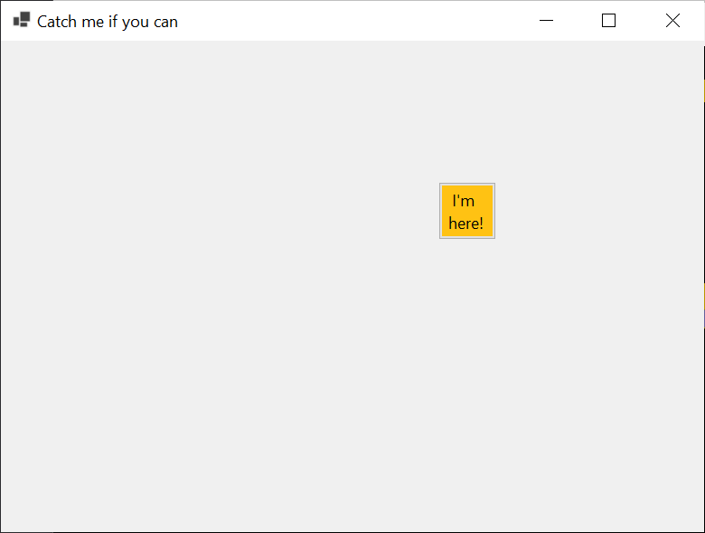

# Catch me if you can

## Summary

It's easy. 😁😁😁

Let click the button within the window.



## Run

Needs [.NET 5](https://dotnet.microsoft.com/download/dotnet/5.0) installation.

### Use Visual studio

Build and run.

### Use CLI

```bash
$ cd src/CatchMeIfYouCan
$ dotnet build
$ dotnet run
```

## Publish

Use self-contained options when needs independent execution file.

e.g.) Publish to Windows x64 target self contained execution file:

```bash
$ cd src/CatchMeIfYouCan
$ dotnet build
$ dotnet publish -c Release --self-contained --runteim win-x64 -o out
```

References:

- [.NET Core application publishing overview](https://docs.microsoft.com/ko-kr/dotnet/core/deploying/#publish-framework-dependent)
- [dotnet publish](https://docs.microsoft.com/ko-kr/dotnet/core/tools/dotnet-publish)
- [.NET Core RID Catalog](https://docs.microsoft.com/ko-kr/dotnet/core/rid-catalog)
